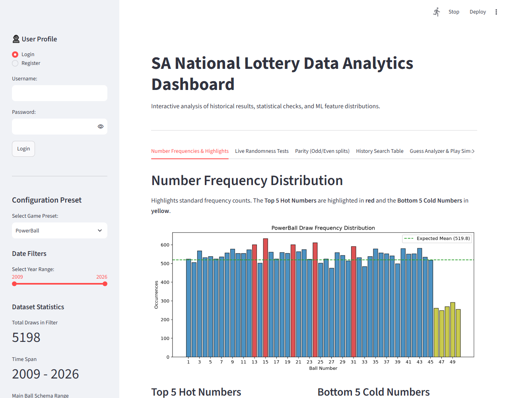
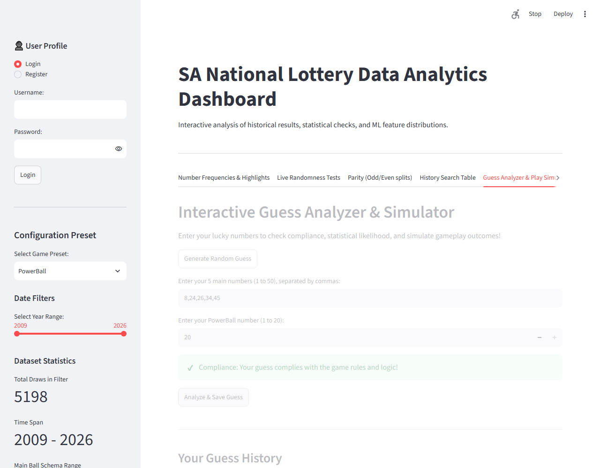

# ArchStractor

A data analytics platform for historical South African lottery results (Lotto, PowerBall, and PowerBall Xtra). Features automated scraping, cleaning and preparation of lottery game data, SQL-based database exporting, analytical report generation, and an interactive Streamlit dashboard.

---

## Showcase Previews

### 1. Interactive Dashboard (Frequencies & Statistical Highlights)


### 2. Guess Analyzer & Play Simulator (Tab 5)


---

## Key Features

1. **Automated Scraping & Caching (`scraper.py`, `parser.py`)**: 
   * Fetches results from national lottery archives.
   * Caches raw HTML locally (`.cache/`) to avoid rate-limiting and minimize network bandwidth.
2. **Robust Validation Pipeline (`validator.py`, `verify.py`)**:
   * Validates duplicate balls, ball ranges, and chronological integrity.
   * Automatically adapts to historical rule changes (such as the Lotto 58-ball matrix transition).
3. **Data Preparation & Export (`prepare.py`, `formatter.py`)**:
   * Cleans datasets and engineers statistical features (such as Odd/Even counts, Draw Sums).
   * Exports sanitized data to CSV, JSON, and local SQLite databases under `data/cleaned/`.
4. **Data Analytics & Randomness Tests (`stats_tests.py`)**:
   * Runs Chi-Square Uniformity checks on main balls and PowerBalls.
   * Performs Wald-Wolfowitz Runs Tests for sequence independence on draw sums.
   * Compares Odd/Even splits against theoretical Binomial $B(N, 0.5)$ distributions.
5. **Streamlit Web App & Local User Profiles (`app.py`, `user_db.py`)**:
   * Interactive sidebar configuration to select game presets (PowerBall, PowerBall Xtra, Lotto) and date sliders.
   * Hassle-free password-protected profiles using native cryptographic hashing (`hashlib.pbkdf2_hmac`), requiring no compilation setup.
   * "Remember Me" session auto-login using a local configuration file.
   * **Monte Carlo Simulator**: Runs up to 1,000,000 randomized draws in under 3.5 seconds to calculate the estimated years needed to hit the jackpot.
   * **Guess Ledger History**: Tracks and displays past guess results on a local SQLite storage isolated from scraped datasets.

---

## Project Structure

* **`src/config.py`**: Central preset configs for Lotto and PowerBall rule specifications.
* **`src/scraper.py`**: Robust HTML retriever with connection retry handling and size limitations.
* **`src/parser.py`**: CSS-class parser resolving winning numbers and bonus ball items.
* **`src/validator.py`**: Multi-rule validation engine.
* **`src/formatter.py`**: Text parser managing raw TXT file formatting and alignment.
* **`src/prepare.py`**: Cleaning runner translating raw TXT draws into CSV, JSON, and SQLite files.
* **`src/stats_tests.py`**: CLI report generator executing uniformity, runs, and binomial statistical tests.
* **`src/app.py`**: Streamlit interactive multi-tab dashboard.
* **`src/user_db.py`**: SQLite database controller managing logins and guess history.

---

## Setup & Quick Start

Ensure you have Python 3.8+ installed. Install the dependencies:

```bash
pip install -r requirements.txt
```

### 1. Build and Clean Datasets
Update the datasets from web archives and compile the databases:
```bash
python src/prepare.py
```

### 2. Run CLI Randomness Tests
```bash
python src/stats_tests.py --input data/cleaned/powerball_clean.csv
```

### 3. Launch Web Dashboard
```bash
streamlit run src/app.py
```
Open `http://localhost:8501` in your browser. Create a user profile in the sidebar, input your lucky guess, and check its likelihood stats!
