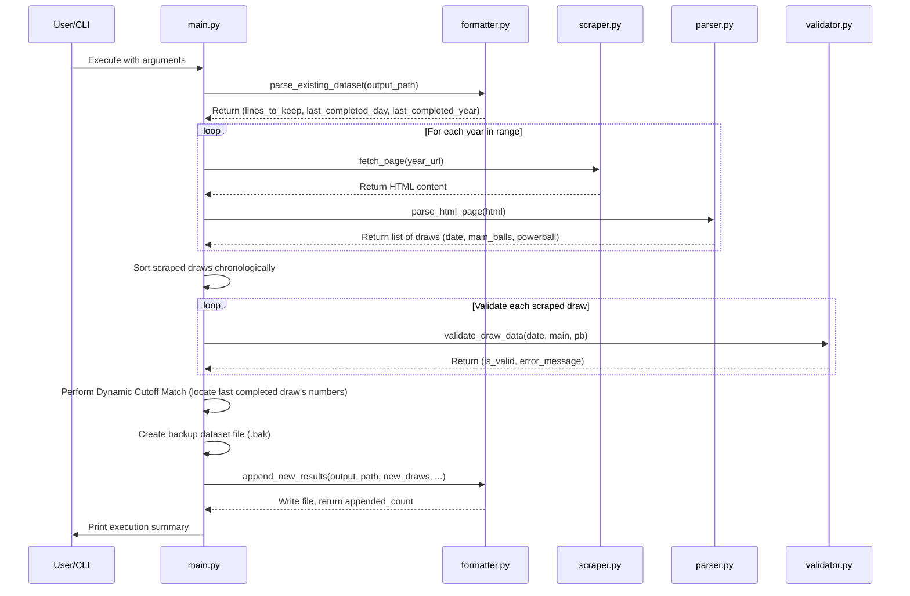

# ArcStractor Developer Guide

This document is intended for developers who wish to understand the inner workings, system architecture, logic, and processes of the **ArcStractor** dataset extractor and builder.

---

## 1. System Architecture & Component Diagram

The project is structured as a collection of modular Python scripts under `src/`. Below is a Mermaid sequence showing how components interact during a standard execution flow:



---

## 2. Module Specifications

### `src/scraper.py`
- **Purpose**: Fetches raw HTML pages from the target South African National Lottery results archive.
- **Key Features**:
  - Implements customized request headers containing a generic browser `User-Agent` to avoid anti-scraping blocks.
  - Implements connection timeout handling (15 seconds).
  - Supports automated single retry logic: if a request fails or returns a non-200 HTTP code, it waits 2 seconds and attempts retrieval once more before raising an exception.

### `src/parser.py`
- **Purpose**: Extracts draw elements (Dates, Main numbers, and PowerBall numbers) from the raw HTML structure.
- **Key Features**:
  - Employs `BeautifulSoup` to parse HTML. It matches the results table using a flexible selector that targets classes like `powerball`, `powerball-plus`, `powerball-xtra`, or `mobResult`. If all else fails, it targets the first table.
  - Utilizes a robust date extractor (`parse_date`) that attempts to regex-match the `{day}-{month}-{year}` pattern inside the row's `href` URL structure first. If missing, it falls back to parsing string structures in the date cell, splitting out weekdays and month names safely.

### `src/validator.py`
- **Purpose**: The central gatekeeper enforcing data formatting and mathematical constraints for draw results.
- **Enforced Rules**:
  - **Date Validation**: The draw date must exist and must not be in the future (greater than the machine's local date).
  - **Ball Counts**: Each draw must contain exactly 5 main numbers and exactly 1 PowerBall number.
  - **Numerical Ranges**: Main numbers must fall within the range `[1, 50]` (covers both historical `1-45` and modern `1-50` pools). The PowerBall must fall within the range `[1, 20]` (covers historical `1-20` and modern `1-16` pools).
  - **Uniqueness Check**: The 5 main numbers must contain no duplicate values.

### `src/formatter.py`
- **Purpose**: Reads existing text data, manages sequencing indices, formats rows, and appends output.
- **Key Features**:
  - Auto-detects target file line endings (`\r\n` for CRLF or `\n` for LF) so that appends do not corrupt file encoding structure.
  - Formats entries in the native schema: `Day X - [N1,N2,N3,N4,N5,[PB]]` with zero internal whitespace.
  - Automatically handles year headers: when a draw's year transitions, it injects a header line formatted as `=== {YEAR} ===`.

### `src/main.py`
- **Purpose**: The main orchestration script. It parses terminal options, manages safety backups, computes cutoff offsets, and manages logs.
- **Dynamic Cutoff Logic**:
  Instead of hardcoding a date threshold, `main.py` parses the ball values of the very last completed entry in the text file. It then runs a chronological search through the newly scraped entries. Once it finds an entry with identical ball values, it sets that date as the `cutoff_date`. All scraped draws on or before this date are safely ignored. This permits seamless incremental updates.
- **Atomic File Backups**:
  Before calling the write module, `main.py` copies the target file to `{filename}.bak`. If the write fails due to disk operations (`IOError`), it attempts to restore the backup file, preventing data corruption.

### `src/verify.py`
- **Purpose**: An offline verification script to test dataset integrity.
- **Validated Items**:
  - Strict sequence checks: Every draw must follow index `Day X + 1` from the previous line.
  - Structural formats: Confirms brackets matching (`Day X - [N1,N2,N3,N4,N5,[PB]]`).
  - Calls `validator.validate_draw_data` on every record in the dataset to confirm that values fall within acceptable pools.
  - Confirms year headings are in strictly increasing order.

---

## 3. Customizing or Extending the Tool

### Adding a Game Preset
To add a new preset game shortcut (like standard `lotto`):
1. In `src/main.py`, update `choices` in the `argparse` configuration:
   ```python
   parser.add_argument("--game", "-g", choices=["powerball", "powerball-xtra", "lotto"])
   ```
2. Map the game to its national-lottery URL template in the template resolution block:
   ```python
   if game == "lotto":
       url_template = "https://za.national-lottery.com/lotto/results/{year}-archive"
   ```
3. Update `src/validator.py` if the game's ball ranges differ from PowerBall's matrix (for example, standard Lotto draws 6 balls out of 52 and has no PowerBall).
