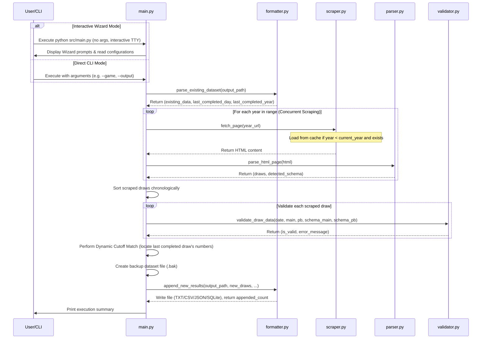

# ArcStractor Developer Guide

This document is intended for developers who wish to understand the inner workings, system architecture, logic, and processes of the **ArcStractor** dataset extractor and builder.

---

## 1. System Architecture & Component Diagram

The project is structured as a collection of modular Python scripts under `src/`. Below is a Mermaid sequence showing how components interact during a standard execution flow:

---

## 2. Module Specifications

### `src/scraper.py`
- **Purpose**: Fetches raw HTML pages from the target South African National Lottery results archive.
- **Key Features**:
  - Implements customized request headers containing a generic browser `User-Agent` to avoid anti-scraping blocks.
  - Implements connection timeout handling (15 seconds).
  - Supports automated single retry logic: if a request fails or returns a non-200 HTTP code, it waits 2 seconds and attempts retrieval once more before raising an exception.
  - **Local HTML Caching**: Saves parsed HTML files to a local `.cache/` folder for all historical years (`year < current_year`). On subsequent runs, it loads from cache instead of hitting the network. The current year is always fetched live.

### `src/parser.py`
- **Purpose**: Extracts draw elements (Dates, Main numbers, and PowerBall/Bonus numbers) and detects game schemas.
- **Key Features**:
  - Employs `BeautifulSoup` to parse HTML. It matches the results table using a flexible selector that targets classes like `powerball`, `powerball-plus`, `powerball-xtra`, `lotto`, or `mobResult`. If all else fails, it targets the first table.
  - Utilizes a robust date extractor (`parse_date`) that attempts to regex-match the `{day}-{month}-{year}` pattern inside the row's `href` URL structure first. If missing, it falls back to parsing string structures in the date cell, splitting out weekdays and month names safely.
  - **Dynamic Schema Detection**: Parses list item classes inside `ul.balls` to identify bonus/powerball indicators (e.g. classes containing `powerball`, `bonus`, `bonusball`, `supp`) vs. normal numbers. It returns the detected schema (number of main balls, number of power/bonus balls) on-the-fly. For standard Lotto, it dynamically detects `{'num_main_balls': 6, 'num_power_balls': 1}`.

### `src/validator.py`
- **Purpose**: The central gatekeeper enforcing data formatting and mathematical constraints for draw results.
- **Enforced Rules**:
  - **Date Validation**: The draw date must exist and must not be in the future (greater than the machine's local date).
  - **Ball Counts**: Each draw must contain exactly the expected count of main and PowerBall/Bonus numbers as declared by the page's schema.
  - **Numerical Ranges**: Main numbers must fall within the range `[1, 58]` (standard Lotto historically ran on 1-58 pool; PowerBall uses 1-50 pool). The PowerBall/Bonus ball must fall within the range `[1, 58]`.
  - **Uniqueness Check**: The main numbers list must contain no duplicate values.

### `src/formatter.py`
- **Purpose**: Multi-format handler reading and writing files according to their file extension.
- **Supported Formats**:
  - **Custom Text (`.txt`)**: Stores data in `Day X - [N1,N2,N3,N4,N5,[PB]]` (or `[N1...N6,[Bonus]]` for Lotto) with `=== YEAR ===` rollover headers.
  - **CSV (`.csv`)**: Reads and writes standard CSV layout dynamically based on the schema (e.g. `day,date,ball_1...ball_N,powerball`).
  - **JSON (`.json`)**: Reads and writes standard formatted JSON arrays of objects containing `day`, `date`, `main_balls`, and `powerball` keys.
  - **SQLite Database (`.db` / `.sqlite`)**: Manages local database tables inside SQLite. Creates/appends rows inside the `draw_results` table.
- **Line Ending Preservation**: Preserves line endings (`\r\n` vs `\n`) for TXT/CSV files.

### `src/main.py`
- **Purpose**: The main orchestration script. It parses terminal options, manages safety backups, computes cutoff offsets, and manages logs.
- **Interactive Configuration Wizard**:
  If the application is run with no parameters (`len(sys.argv) == 1`) in an interactive terminal context (`sys.stdin.isatty()`), it starts a wizard prompting the user to select the game preset (`powerball`, `powerball-xtra`, `lotto`), year bounds, and output destination path on the fly.
- **Dynamic Cutoff Logic**:
  Instead of hardcoding a date threshold, `main.py` parses the ball values of the very last completed entry in the target file. It then runs a chronological search through the newly scraped entries. Once it finds an entry with identical ball values, it sets that date as the `cutoff_date`. All scraped draws on or before this date are safely ignored.
- **Atomic File Backups**:
  Before calling the write module, `main.py` copies the target file to `{filename}.bak`. If the write fails due to disk operations (`IOError`), it attempts to restore the backup file, preventing data corruption.

### `src/verify.py`
- **Purpose**: An offline verification script to test dataset integrity.
- **Key Features**:
  - **Auto-Format Detection**: Checks file extension to choose either raw line parsing (for TXT files) or structured record verification (for CSV, JSON, and SQLite).
  - **Sequence Validation**: Confirms that day indexes are strictly sequential (incrementing by 1), year timelines are ascending, and calls the central `validator.py` constraints on each draw.

---

## 4. Containerization & Tooling

### Docker & Docker Compose
The application is fully containerized to run in any isolated environment:
- **`Dockerfile`**: Builds a lightweight image using `python:3.11-slim` and installs requirements compiled in `requirements.txt`. It sets `ENTRYPOINT ["python", "src/main.py"]` to transparently forward container arguments.
- **`docker-compose.yml`**: Defines volume mappings:
  - Maps `./data` directory to persist dataset files on the host machine.
  - Maps `./.cache` to preserve scraped HTML pages on the host across builds and executions.
  - Maps `./extraction.log` to write execution history.
  - Confirms `stdin_open: true` and `tty: true` to support running the Interactive Wizard in Docker.

### Automated GitHub Actions CI
- **Configuration Path**: `.github/workflows/verify-dataset.yml`
- **Job Purpose**: Triggers on `push` or `pull_request` affecting `data/**` or `src/**`.
- **Process**: Sets up a Python virtual machine, installs requirements, and runs `python src/verify.py` on the datasets in `data/`. If any format validation or sequencing indexing checks fail, the workflow run fails immediately, safeguarding the repository against invalid dataset check-ins.
